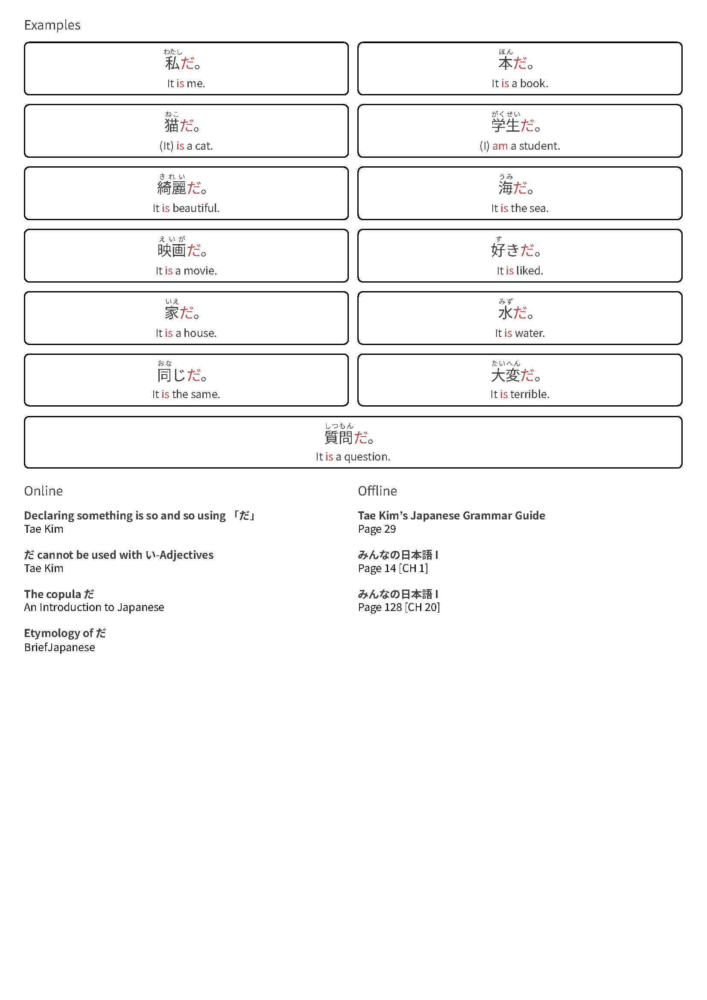

# Bunpro Grammar Print Helper

[Bunpro](https://bunpro.jp) is excellent for online study but does not offer printable versions of grammar points. This project addresses that gap by including a tampermonkey script that adds a print button to grammar pages. Also, in this repository, you can find Jupyter notebooks for downloading and compiling all grammar points into a single PDF book.

## Examples

<div style="display: flex; gap: 10px; margin-bottom: 10px;">
    
    
</div>


## Features

1. **Tampermonkey Script:** Adds a "Print" button to grammar point pages, which converts the page into printable version when clicked.
2. **Jupyter Notebooks:**
    * `parser.ipynb`: Scrapes grammar points from all Bunpro decks and saves them as individual PDFs.
    * `pdf-builder.ipynb`: Combines PDFs into a single grammar book.

## How to use the tampermonkey script
### Installation

1. Install the [Tampermonkey extension](https://www.tampermonkey.net/).
2. Copy the `tampermonkey.user.js` file content.
3. Create a new script in tampermonkey and paste the code.
4. Save the script and ensure tampermonkey and the script are enabled.

### Usage

1. Navigate to any grammar point page on [Bunpro](https://bunpro.jp).
2. A print button will appear in the bottom left corner.
3. Adjust the print scale using the slider on the button hovering.
4. Click the print button to generate a printable page version.
5. Press `Ctrl + P` to print the page or save it as PDF.

## How to compile a single grammar book

1. Clone this repository to your local machine:
    ```bash
    git clone https://github.com/Maximax67/bunpro-grammar-print-helper.git
    cd bunpro-grammar-print-helper
    ```
2. Install Python dependencies in the `requirements.txt` file:
    ```bash
    pip install -r requirements.txt
    ```
3. Run `parser.ipynb` to save individual PDFs of grammar points.
4. Use `pdf-builder.ipynb` to merge the PDFs into a single grammar book.

## Precompiled Grammar Book

For convenience, you can download the already-compiled grammar book from [Google Drive](https://drive.google.com/file/d/1EaRQ_VJb9leiTCH1dkemY4pdHHFV1Y8y/view?usp=sharing) (162.8 MB).

**Links shortcuts guide:** Hold Ctrl to open links in a new tab or Shift for a new window. Clicking on the grammar point name will open it on the [Bunpro](https://bunpro.jp) website.

## Disclaimer

**According to Bunpro’s terms of service, all materials are protected by copyright and trademark law.** This project was created purely to enhance my personal learning experience and is shared for free to help others interested in the same. If someone from Bunpro requests, I will remove this repository immediately.

The scripts have licensed as MIT. Do whatever you want with my code.

## Contact Me

* Email: maximax6767@gmail.com
* Telegram: [@Maximax67](https://t.me/Maximax67)
* GitHub: [Maximax67](https://github.com/Maximax67)
